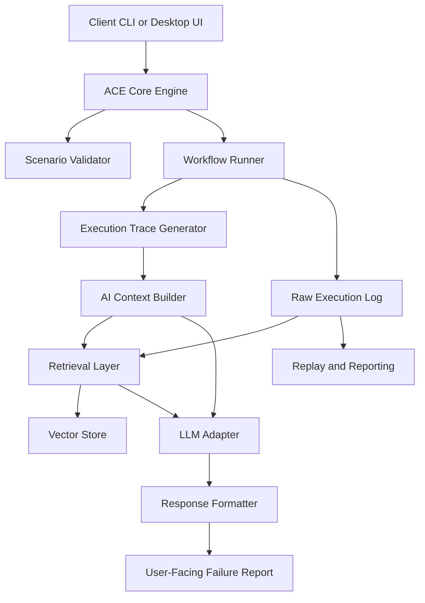
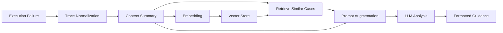

# ACE AI Architecture

This document reframes the PDF note into an implementable architecture for ACE as a deterministic workflow engine with an optional AI-assisted debugging layer.

## System Goal

ACE should remain deterministic in execution and validation while adding an AI layer that explains failures, retrieves similar incidents, and proposes next actions. The execution engine stays authoritative. AI is advisory.

## Design Principles

- Deterministic workflow execution remains the source of truth.
- Validation and replay must work without any AI dependency.
- Failure analysis should be driven by structured traces, not raw prompt stuffing.
- Retrieval and LLM steps should be optional and composable.
- AI output should be explicitly marked as inferred guidance, not engine truth.

## Logical Architecture



## Execution Flow

1. A user triggers a workflow from the CLI, API, or desktop UI.
2. ACE validates the scenario before execution.
3. The runner executes the workflow deterministically and records each step.
4. If execution fails, ACE emits a structured trace with failure location, request context, response context, and assertion outcomes.
5. The AI context builder reduces that trace into a compact failure summary.
6. The retrieval layer optionally looks up similar historical failures.
7. The LLM adapter receives the structured summary and retrieved cases.
8. The response formatter returns a concise explanation, likely cause, and suggested fixes.

## Runtime Components

### 1. ACE Core Engine

Responsibilities:

- Load and validate scenario definitions.
- Execute state-machine workflows.
- Apply variables, retries, hooks, auth, and transitions.
- Produce replayable logs and deterministic outputs.

### 2. Execution Trace Generator

Responsibilities:

- Convert runtime events into a structured trace.
- Capture the failing step, state transitions, timing, request body, response body, and assertion failures.
- Normalize outputs so downstream AI components do not depend on terminal formatting.

### 3. AI Context Builder

Responsibilities:

- Summarize the raw trace into a bounded prompt-ready structure.
- Identify the failure point, preceding causal steps, and likely missing variables or state mismatches.
- Redact or mask sensitive values before retrieval or LLM use.

### 4. Retrieval Layer

Responsibilities:

- Index prior failures and successful remediations.
- Retrieve similar traces using embeddings or deterministic fingerprints.
- Return compact evidence snippets for prompt augmentation.

### 5. LLM Adapter

Responsibilities:

- Accept structured `AIInput`.
- Generate a likely cause, explanation, and suggestions.
- Keep prompts narrow and grounded in trace evidence.
- Support provider-specific adapters without leaking provider details into the engine.

### 6. Response Formatter

Responsibilities:

- Merge engine facts and AI guidance into a single report.
- Separate observed facts from inferred recommendations.
- Support CLI, JSON, UI, and machine-readable outputs.

## Data Contracts

The PDF’s schemas are a good start, but they need a little more structure to be useful in production.

```text
Trace {
  workflow_id
  scenario_name
  started_at
  terminal_state
  steps[]
  error
}

TraceStep {
  step_name
  state_before
  state_after
  method
  url
  status
  duration_ms
  request_body
  response_body
  assertions[]
}

AIInput {
  failure_point
  summary
  error
  terminal_state
  recent_steps[]
  retrieved_cases[]
}

AIOutput {
  cause
  explanation
  confidence
  suggestions[]
  citations[]
}
```

## RAG Pipeline



## Operational Concerns

### Performance

- Cache AI responses for repeated failures with the same normalized signature.
- Batch embeddings when indexing historical logs.
- Make retrieval and LLM analysis asynchronous relative to the core engine when possible.
- Allow users to disable AI entirely for low-latency or offline execution.

### Safety

- Redact secrets from headers, bodies, and environment-derived variables.
- Bound token usage by summarizing traces before prompt construction.
- Mark every AI suggestion as advisory.

### Observability

- Emit metrics for trace generation, retrieval latency, LLM latency, cache hit rate, and suggestion acceptance.
- Preserve raw engine logs separately from AI-enriched reports.

## Trade-offs

- Accuracy vs latency: richer retrieval and larger prompts improve analysis but slow feedback.
- Simplicity vs flexibility: a narrow AI contract is easier to maintain than free-form agent behavior.
- Cost vs performance: embeddings and LLM calls should be reserved for failure paths or explicit user requests.

## Recommended Implementation Order

1. Stabilize a structured trace schema from current execution logs.
2. Add a context builder that produces bounded summaries without any LLM dependency.
3. Introduce a pluggable AI interface behind a feature flag.
4. Add retrieval over historical execution failures.
5. Expose AI-enriched reports in CLI and desktop UI.
